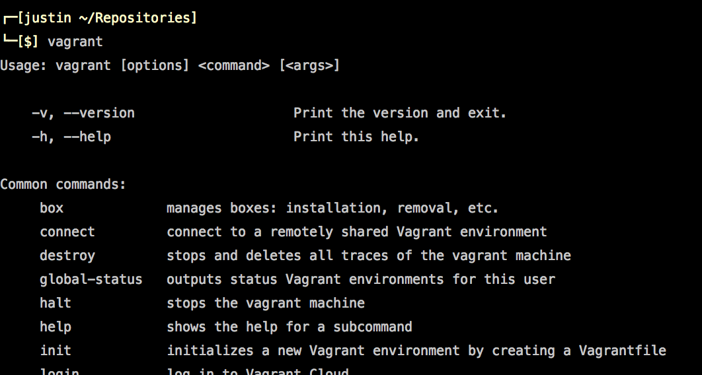

# Simplifying Dev Environments With Vagrant
## by: Justin Tallant

---

# Follow Along

Code Snippets:
```
https://gist.github.com/jtallant/d0342b83cd09b095e49a
```

---

# Problems With Dev Environments
# MAMP/XAMPP
	- Difficult to Modify (install extensions)
	- Environment customizations aren't easily reproducible or portable

---

# Problems with Dev Environments
# Homebrew
	- Increased flexibility comes with more technical overhead than packaged solutions
	- Environment customizations aren't easily portable or reproducable

---

# Enter Vagrant
> Vagrant provides easy to configure, reproducible, and portable work environments built on top of industry-standard technology and controlled by a single consistent workflow to help maximize the productivity and flexibility of you and your team.

=> https://docs.vagrantup.com/v2/why-vagrant/

---

# How is this easier?
1. Create a vagrant file
1. Share it with your team
1. Run `vagrant up` from terminal

It doesn't matter if your OS is Windows, Mac, or Linux. You now have a working dev environment that is identical to the rest of your team.

---

# What is this actually doing?
Vagrant uses [VirtualBox](https://www.virtualbox.org/) to create a virtual machine on your computer. It creates a Linux environment on your computer that is isolated from your OS.

---

# An OS running on your OS


---


# Setting up Vagrant

---

# Install Dependencies
1. Install Vagrant
http://www.vagrantup.com/downloads.html
1. Install VirtualBox
https://www.virtualbox.org/wiki/Downloads

These are simple installers. Just download and run.

---


# Verify Installation
Terminal
\> vagrant

^ Action: type vagrant into terminal

---

# Add a Box
`vagrant box add laravel/homestead`

^ Action: add the box

---

# Wait! What is a box?
> Boxes are the package format for Vagrant environments. A box can be used by anyone on any platform that Vagrant supports to bring up an identical working environment.

=> http://docs.vagrantup.com/v2/boxes.html

---

# Why Laravel Homestead?
> Laravel Homestead is an official, pre-packaged Vagrant "box" that provides you a wonderful development environment without requiring you to install PHP, a web server, and any other server software on your local machine. No more worrying about messing up your operating system! Vagrant boxes are completely disposable. If something goes wrong, you can destroy and re-create the box in minutes!

=> http://laravel.com/docs/homestead

---

# Not using PHP?

Discover other Vagrant boxes here:
https://vagrantcloud.com/discover/featured

---


# Configuring Homestead

---

# Clone the Homestead Repo

Pulling down the laravel/homestead repo will provide us with some solid default configurations.

Make sure you put it in a central location that you can easily access.

You will come back to this repo to add sites and applications to your VM.

```bash
git clone https://github.com/laravel/homestead.git
```

^ Action: Clone the homestead repo

---

# Generate an SSH Key

You probably already have a public and private key. Check and make sure.

```bash
ls -a ~/.ssh | grep id
```
=> `id_rsa`
=> `id_rsa.pub`

If you don't see these keys listed, generate them.

```bash
ssh-keygen -t rsa -C "your@email.com"
```

^ Action: Verify you have SSH keys

---

# Bash Detour

The next slide will make use of `$EDITOR`. It is a sort of "global" bash variable you can set to your favorite editor. Programs like Git make use of it when told to do so.

In `.bash_profile`

```bash
export EDITOR="subl -w"
```

Restart terminal

^ Action: Open your bash_profile and add the EDITOR variable to it.

---

# Alias all the things
```bash
# Quick access to Bash Profile
alias bp="$EDITOR ~/.bash_profile"
# Quick access to homestead directory from terminal
alias homestead="cd /path/to/your/homestead/repo"
# Quick access to hosts file from terminal
alias hosts="nano /private/etc/hosts"
# Quick access to VM
alias vm="ssh vagrant@127.0.0.1 -p 2222"
```

^ Action: Add these aliases to your .bash_profile

---

# Edit homestead.yaml
Change the paths in homestead.yaml to match your paths

```
authorize: /Users/you/.ssh/id_rsa.pub

keys:
  - /Users/you/.ssh/id_rsa

# map: The path to the directory you keep your sites in
# to: The directory your sites will be synced to on the VM
folders:
  - map: /Users/you/Sites
    to: /home/vagrant/Sites

# map: The domain you want to access the site at. This should also go in your hosts file.
# to: The public directory of the app or site you are accessing at the domain name specifed in 'map'
sites:
  - map: homestead.app
    to: /home/vagrant/Sites/Laravel/public

variables:
  - key: APP_ENV
    value: local
```

^ Action: Replace the paths with your paths

---

# Edit aliases for your VM

Remember that your VM is separate from your machine. It will have its own bash aliases. You can configure them in the aliases file of your homestead directory.

^ P: Show the aliases file

---

# Vagrant Up

Now that you have edited Homestead to your liking. You are ready to start and provision the vagrant environment.

From the homestead directory:

```bash
vagrant up
vm
```

Check out your new Ubuntu environment!

---

# Adding a Site

---

# Clone the vagrant-test repo

Let's pull in some basic PHP files to show how a site can be added to homestead.yaml

`cd` into your sites directory.

I keep my sites in  `/Users/justin/Sites`

```bash
git clone git@github.com:surprisehighway/vagrant-test.git
```

^ Action: Clone the vagrant-test repo

---

# Add the site to homestead.yaml

```
folders:
  - map: /Users/justin/Sites/vagrant-test
    to: /home/vagrant/Sites/vagrant-test

sites:  
  - map: local.vagrant-test.com
    to: /home/vagrant/Sites/vagrant-test/public
```

^ Action: Edit homestead.yaml

---

# File Syncing

Files located in a folder that is mapped in Homestead.yaml are synced with files in the "to" key and vice versa. This means you can use your favorite editor to edit your sites and apps. You don't have to do all of your editing over SSH.

---

# Add the domain to your hosts file

Terminal: `hosts`
`127.0.0.1   local.vagrant-test.com`

^ Action: Open up hosts file and add the vagrant-test domain

---

# Provision your VM

Every time you edit your homestead.yaml file, you need to let vagrant know about the changes.

Restart the VM and provision.

From the homestead directory:

`vagrant reload --provision`

^ Action: Run vagrant reload --provision
^ You can also vagrant destroy && vagrant up

---

# Hit the URL

`http://vagrant-test.com:8000`

^ Action: Hit the URL in browser
^ Q: Yes you can get rid of the port

---

# Adding more sites

1. Add the site to homestead.yaml
1. Add the site to your hosts file
1. `vagrant reload --provision`

```
folders:
  - map: /Users/justin/Sites/vagrant-test
    to: /home/vagrant/Sites/vagrant-test
  - map: /Users/justin/Sites/some-other-site
    to: /home/vagrant/Sites/some-other-site

sites:  
  - map: local.vagrant-test.com
    to: /home/vagrant/Sites/vagrant-test/public
  - map: local.some-other-site.com
    to: /home/vagrant/Sites/some-other-site/public
```

---

# Where to go from here

* Connect to databases in your vagrant env with Sequel Pro or Navicat.
http://laravel.com/docs/homestead#daily-usage
* Learn about Vagrant provisioning. This is how we could add apache to our shared environment.
http://docs.vagrantup.com/v2/getting-started/provisioning.html